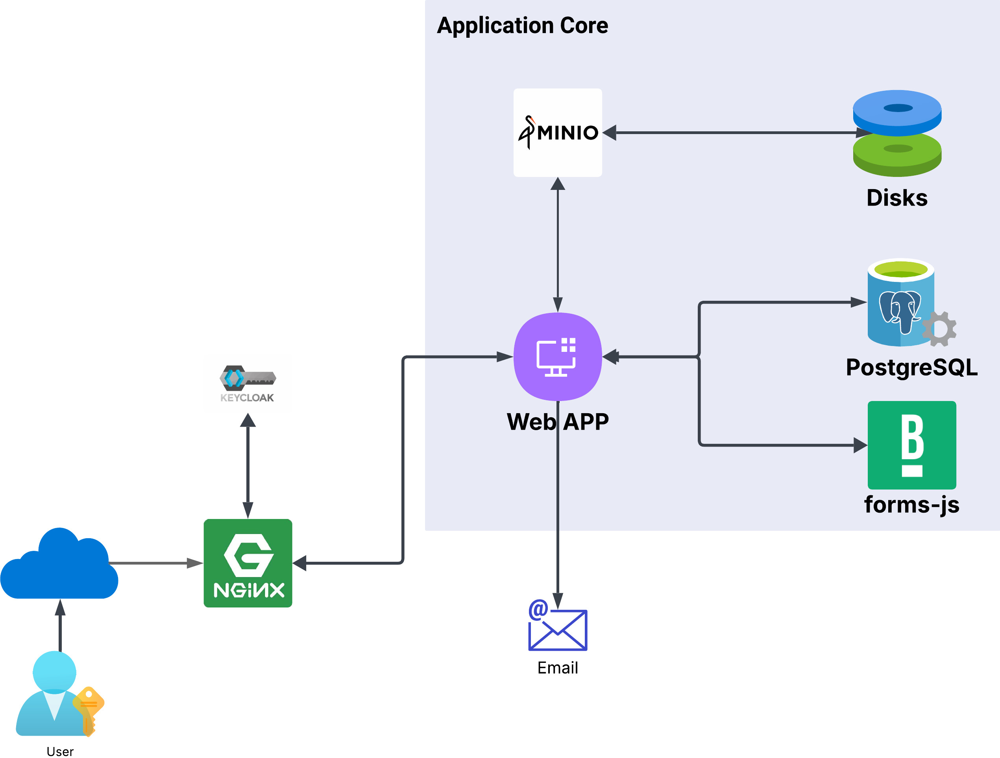

[Voltar](indice.md)

# Documento de Arquitetura

## Objetivos

- Descrever a arquitetura de software que será utilizada no **Sistema de Perícia Animal** solicitado pelo **Ministério Público de Minas Gerais** (**MPMG**);
- Os recursos mencionados neste documento, estão dimensionados para uso exclusivo da aplicação.

## Recursos necessários

| Recurso | Especificação                                                                 |
| ------- | ------------------------------------------------------------------------------- |
| DNS     | Fornecer subdomínio pericia.mpmg.mp.br                                         |
| Docker  | O host hospedeiro deve conter docker para criação dos contêineres do sistema |
| E-mail  | Disponibilizar conta para envio de alertas pericia@mpmg.mp.br                   |
| SSL     | Disponibilizar certificado digital para segurança do sistema                   |

### DNS

| URL                | Aplicação                   |
| ------------------ | ----------------------------- |
| docs.mpmg.mp.br    | Serviço de documentos        |
| auth.mpmg.mp.br    | Serviço de autenticação    |
| pericia.mpmg.mp.br | Aplicação propriamente dita |

### Docker

Docker é uma plataforma aberta para desenvolvimento, envio e execução de aplicações. Ele permite que você separe suas aplicações da infraestrutura, facilitando a entrega rápida de software. Com Docker, podemos gerenciar a infraestrutura da mesma forma que gerencia suas aplicações, utilizando contêineres que são ambientes isolados e leves.

#### Pontos principais sobre Docker:

- **Contêineres**: Docker usa contêineres para empacotar e executar aplicações em um ambiente isolado. Isso garante que a aplicação funcione da mesma forma em diferentes ambientes
- **Portabilidade** : Os contêineres Docker podem ser executados em laptops, máquinas físicas ou virtuais, provedores de nuvem, ou em uma combinação desses ambientes.
- **Escalabilidade**: Docker facilita a gestão dinâmica de cargas de trabalho, permitindo escalar aplicações e serviços conforme necessário.
- **Desempenho**: Docker é leve e rápido, oferecendo uma alternativa viável e econômica às máquinas virtuais baseadas em hipervisor.

## E-mail

- O sistema deverá ser capaz de enviar e-mail de alertas para seus usuários. Para tanto será necessária uma conta utilizada somente para envio.

#### Para configurar um servidor SMTP, você precisará de algumas informações básicas

- **Endereço do servidor SMTP**: Este é o endereço do servidor que você usará para enviar e-mails. Pode ser algo como smtp.seuprovedor.com.
- **Porta SMTP**: As portas comuns são:
  - **Porta 25**: Usada para comunicação entre servidores de e-mail, mas pode ser bloqueada por alguns provedores de internet.
  - **Porta 465**: Usada para conexões seguras com SSL.
  - **Porta 587**: Recomendada para conexões seguras com TLS.
- **Autenticação**: Nome de usuário e senha para autenticar no servidor SMTP.
- **Protocolo de segurança**: SSL ou TLS, dependendo da porta que você escolher.

Observação: Para nome de usuário, que é o nome da conta, sugerimos pericia@mpmg.mp.br.

### SSL

Deverá ser fornecido um certificado SSL para cada domínio especificado na sessão DNS.

### Rede

| Recurso                                  | Especificação |
| ---------------------------------------- | --------------- |
| Características da internet do servidor | 700 Mbit/s      |
| Características da internet do usuário | 5   Mb/s        |

### Armazenamento

Para garantir a segurança e disponibilidade dos documentos, será utilizado um serviço de gestão de aquivos, este serviço só será acessado pelo sistema de perícia, garantindo total integridade e confidencialidade dos dados.

#### Servidor de documentos

- O servidor de documentos é uma solução de armazenamento de objetos de alta performance. Ele é projetado para armazenar grandes quantidades de dados não estruturados, como fotos, vídeos, arquivos de log e backups.

##### Pontos principais sobre o serviço

- **Alta Performance**: Otimizado para alta performance, permitindo operações rápidas de leitura e escrita.
- **Escalabilidade**: Ele pode ser escalado horizontalmente para acomodar grandes volumes de dados, tornando-o ideal para ambientes de big data.
- **Compatibilidade com S3**: É totalmente compatível com o protocolo S3 da Amazon Web Services (AWS), facilitando a integração com aplicações que já utilizam AWS S3.
- **Open Source**: É uma solução open source, o que significa que você pode modificar e distribuir o software conforme suas necessidades.

## Backup

- Informações a serem copiadas

  - Banco de dados;
  - Servidor de arquivo;
  - Servidor de autenticação.
- Local de armazengem

  - Drive em servidor externo.

### Estratégia de backup

| Backup  | Tempo de Retenção |
| ------- | ------------------- |
| Diário | 8 dias              |
| Semanal | 10 semanas          |
| Mensal  | 16 meses            |
| Anual   | Indefinido          |

### Rotina de envio

- A rotina denvio de backup deverá ter acesso ao servidor de backup, através do protocolo sFTP
- Credenciais de acesso:

| Parâmetro              | Exemplo                             |
| ----------------------- | ----------------------------------- |
| URL                     | ftp://bkp_externo.example.com       |
| Usuário                | usrbackup                           |
| Senha                   | password                            |
| Caminho dos diretórios | /bkp_pericia/diario (mensal, anual) |

## Infraestrutura

### Configuração do Host

| Recurso            | Especificação                   |
| ------------------ | --------------------------------- |
| VCPUs              | 8                                 |
| Memória RAM       | 16 Gb                             |
| Linguagem          | Python 3.13                       |
| Espaço em disco   | 1 Tb**(sujeito a confirmação)** |
| Banco de Dados     | Postgres 17.04                    |
| Acesso à internet | Link de pelo menos 600 Mbps       |

### Configuração do servidor de backup

| Recurso          | Especificação                   |
| ---------------- | --------------------------------- |
| Espaço em disco | 3 Tb**(sujeito a confirmação)** |

### Plataforma

Todas as soluções propostas são OpenSource e sua utilização não incorrem em custos para o MPMG.

| Serviço                      | Produto                                    |
| ----------------------------- | ------------------------------------------ |
| Sistema Operacional           | Linux Ubuntu 24.04                         |
| Gerenciamento de Contêineres | Docker 28.0.4                              |
| Linguagem                     | Python                                     |
| Framework                     | Fast-API                                   |
| Banco de Dados                | Postgres 17.04                             |
| Servidor de Identidade        | Keycloak 26.1.3                            |
| Servidor de Arquivos          | MinIO 2025-03-12T18-04-18Z                 |
| Servidor Web                  | Nginx nginx-1.26.3                         |
| forms.js                      | [bpmn-io](https://github.com/bpmn-io/form-js) |

## Diagramas

### Componentes

#### **Host**

#### **Container**

#### **Application**

### ***Arquitetura***

[Voltar](indice.md)
