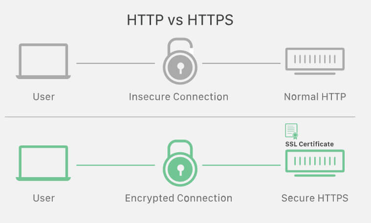
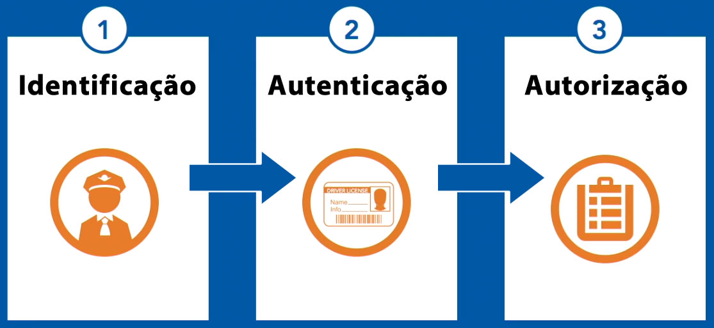
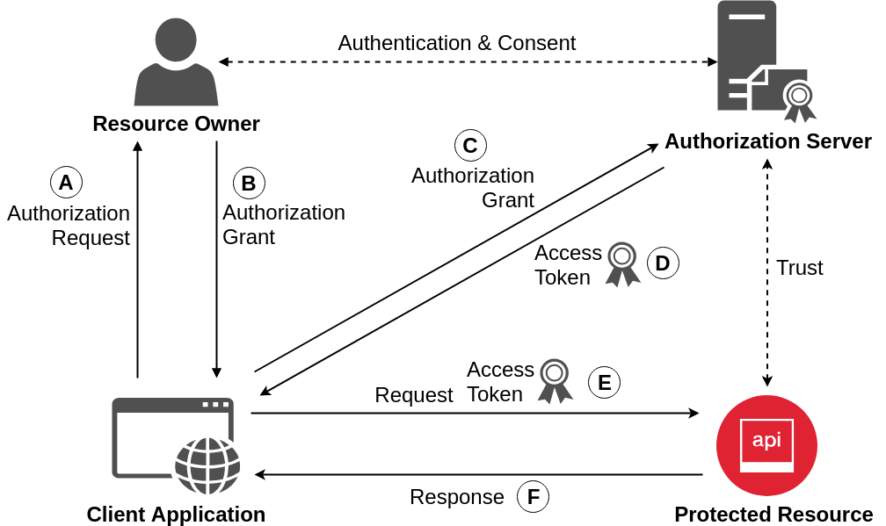
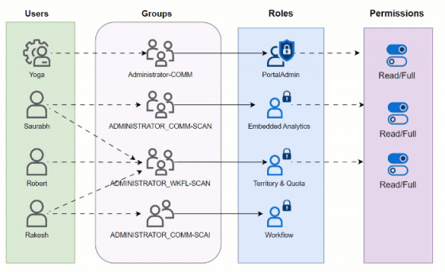
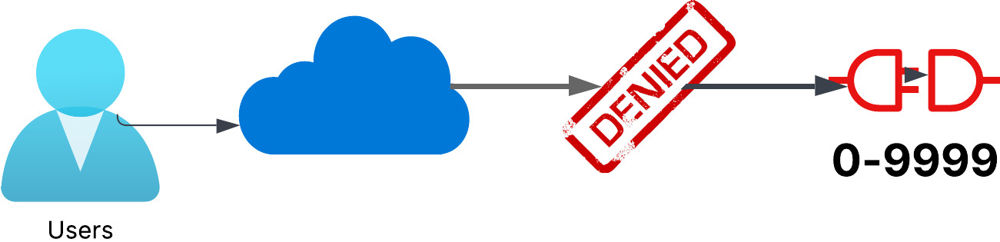
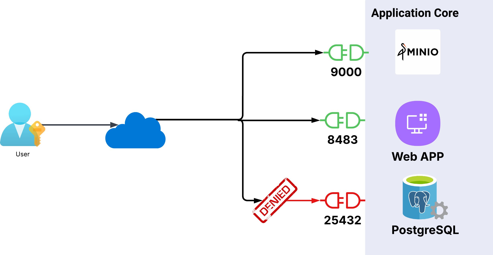
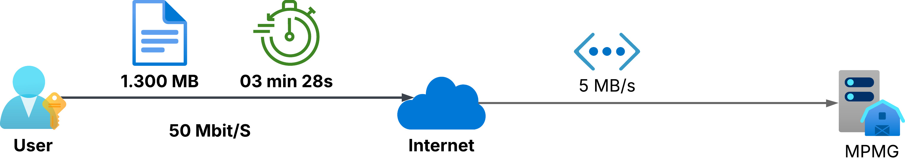
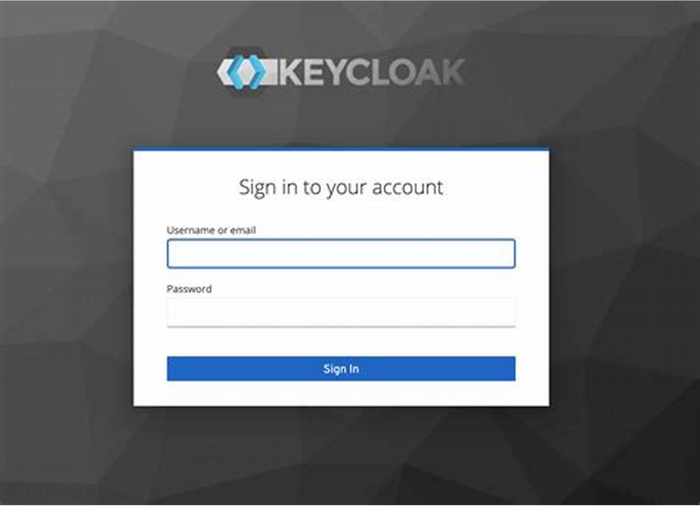

[Voltar](indice.md)

# Requisitos não funcionais

## Estilo gramatical

Este documento é uma proposta de implementação **em construção**. Por padrão gramatical, os documentos de requisitos utilizam a expressão **"deve ser capaz"**.

Os temas aqui descritos são sugestões de implementação. Contudo, após a formalização, as sentenças passam a ser mandatórias.

## Segurança

### HTTP criptografado utilizando SSL

**Sugere-se utilizar certificados SSL do lado do cliente**

### Incluir no PDF final fomalizado

**Os documentos finais devem conter**

- Marca d'água do MPMG
- Informação de data/hora e usuário que imprimiu

### Acesso ao sistema

 

### Autenticação via OAuth 2.0

**Sugere-se utilizar autenticação de dois fatores**

### Autorização utilizando o padrão **Role-based access control (RBAC)**

### Negação de acesso

- Usuários não autenticados não podem acessar nenhuma porta.

### Permissão de acesso

- Usuários autenticados podem acessar as portas 9000/8483;
- Usuários autenticados não acessam o banco de dados.

## Upload de Anexos

- O sistema prevê upload dos seguintes formatos:

| Extensão    | Tipo de Documento                           | Tipo MIME                                                         |
| ------------ | ------------------------------------------- | ----------------------------------------------------------------- |
| .avi         | AVI: Audio Video Interleave                 | video/x-msvideo                                                   |
| .bmp         | Windows OS/2 Bitmap Graphics                | image/bmp                                                         |
| .csv         | Comma-separated values (CSV)                | text/csv                                                          |
| .docx        | Microsoft Word (OpenXML)                    | openxmlformats-officedocument.wordprocessingml.document           |
| .epub        | Electronic publication (EPUB)               | application/epub+zip                                              |
| .jpeg, .jpg | JPEG images                                 | image/jpeg                                                        |
| .mid, .midi | Musical Instrument Digital Interface (MIDI) | audio/midi, audio/x-midi                                         |
| .mp3         | MP3 audio                                   | audio/mpeg                                                        |
| .mp4         | MP4 video                                   | video/mp4                                                         |
| .png         | Portable Network Graphics                   | image/png                                                         |
| .pdf         | Adobe Portable Document Format (PDF)      | application/pdf                                                   |
| .pptx        | Microsoft PowerPoint (OpenXML)              | vnd.openxmlformats-officedocument.presentationml.presentation     |
| .svg         | Scalable Vector Graphics (SVG)              | image/svg+xml                                                     |
| .wav         | Waveform Audio Format                       | audio/wav                                                         |
| .xlsx        | Microsoft Excel (OpenXML)                   | application/vnd.openxmlformats-officedocument.spreadsheetml.sheet |

## Métrica de uploads

- Um vídeo de 10 minutos sem compactação possui aproximadamente 1,3 Gb;
- Um usuário deve ser capaz de enviar um arquivo de 1,3 Gb em menos de quatro minutos.

## Sistema de autenticação e autorização

### Tela de login

[Voltar](indice.md)
