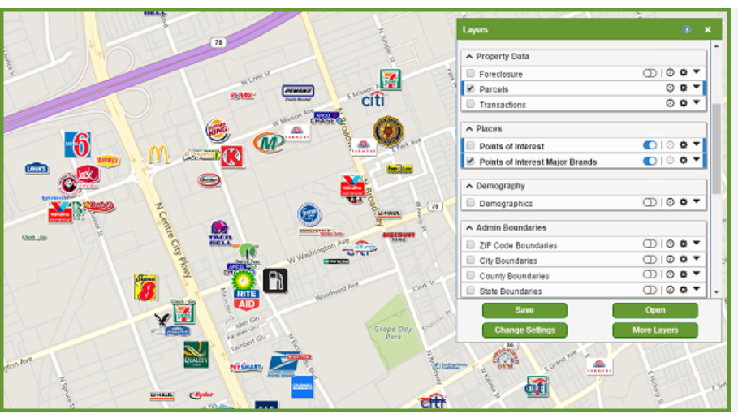

[Voltar](../req_fun.md)

# RF025 - Mapa dos locais da perícia

## Descrição

Esta funcionalidade deve exibir um mapa baseado nos filtros do grid de perícia

## Atores

- Administrador
- Gestor

## Observações

- Não se aplica

## Tela

Exemplo de mapa

# Aprovação

[Voltar](../req_fun.md)
