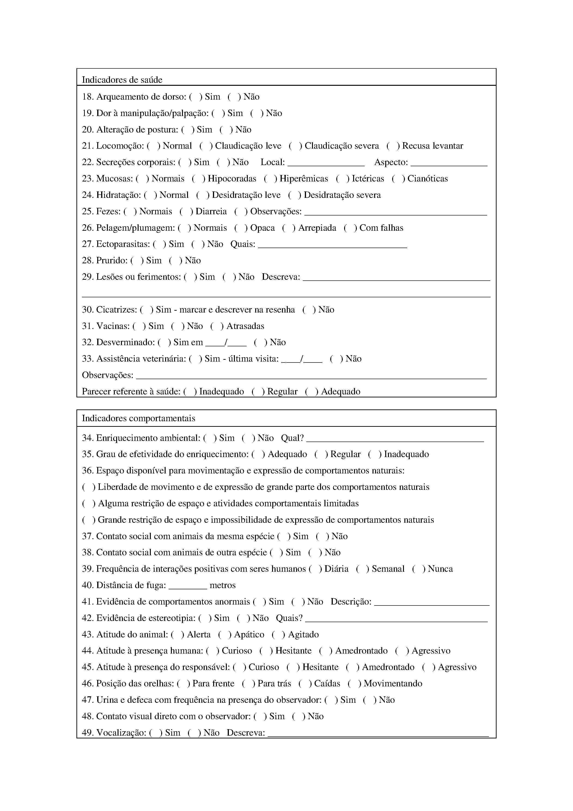
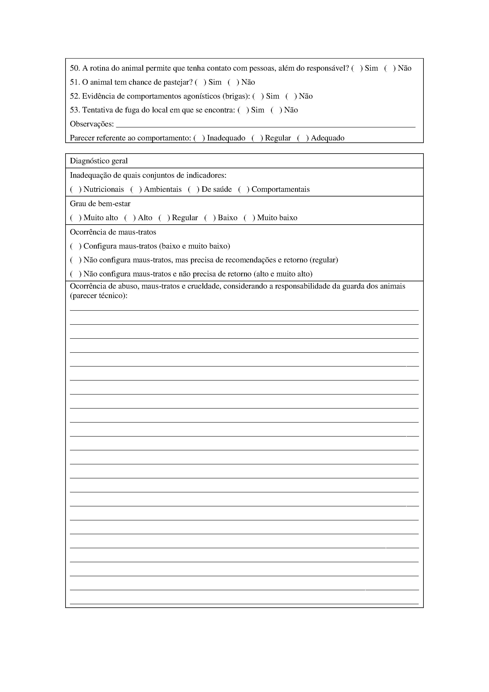

[Voltar](../req_fun.md)

# RF030 - Cadastrar, calcular e manter Protocolo de Perícia em Bem-Estar Animal (PPBEA)

## Descrição

Permite ao ator cadastrar e calcular o **PPBAE - PROTOCOLO DE AVALIAÇÃO DE BEM-ESTAR ANIMAL E MAUS TRATOS**

## Atores

- Perito

## Observações

- Não se aplica

## Tela

[![](https://img.plantuml.biz/plantuml/svg/nLRRQjj047qNw1-6vYNPnfT8SQbDC94l2G7VQhkb49AmaJRkKadhxguAgUEdFlGV-XRwK2WK2gK_KFrOTnKbTdpBxQ4h6skMcJCxPuurCerT8J6N0liI81hw37idc7-8w4TsukF8OwQn8-IvJygcePrg50yu3c1a6W0LxBuVS1Q5NfNvZCFQsGjr5KnZhA9oDs7lQJZ4EiWRKjZAvqr3KkaJs6CyYFpuabC627Kw5QSE6UXqs_rsjTreGwqEpXkdSU34N-BFYLcfDpFrNj_fWjCwQ3eDg4FJUTs3VjVfjti8cSOxWZt2mQbNsqtJE6DCAgj7XIG11ez0X_3ufqinD3lDVTDmyL1I5aALrQzZL6NwWdIDZX5gQ2AWzVSNGh3Zwb9Bftv4oWXPjcLdh8BE35CBeHeHBgVnz_WRGwW4BWi5SIMH4GViqI4LBWq7G7mgDq4G3nG-eP48c7SRAJiBt5U5QCG6uoG0EXIHuZLXNr09E20IBfHRJs8P2UsOme9YOCZu7UWrB1EQgjZ3GlBaxFcjN7uxP-MjWa9Eo-V4AwVUFWse98cZbSiN4iSxiZIOYttw2I-a9pDDK4PHb5LfLL3yrPTKDL69aF19gFKobxUlJcVbI_Rgr3Fcw5ZhZd0gcPXjeLvsOTiksDi5TOpbT2y8isrB2GCU43Q-RLvS7QtjCixZ7w7IQqb9p_DoGP0xLsiydtHLYJKIHXh4OwL5PIA4MYnGBTI97wtK5AdQsTD02gbOB6RJRwPONEJSFXMfxvEoPly_m5mt9nitHdRoO4cwyYeYGiP_o2tfJI5jhL3FvfBpJfzZ7MtqQ03hi04jzMTPcCDwMev3E5f6tBJNswLUS2-mUs4z42cxyDP-8kVFPfLnlRymcru8PUUdnrrReyCgzjt8n_n8ILSPeKkqCPvBCxxHtlnFei8k4P4lrQD1LIkW6bzgNBPCawErkNaK_nvILpsAax5pWpPRmCfnbGwL0ISaB3lF7nx9E0u7f5nvHAYUP539F2vmEcwAUqN6XDPzDQtyqkJD8Qrokin9hxB9Hztiaj3Jxrl_0000)](https://editor.plantuml.com/uml/nLRRQjj047qNw1-6vYNPnfT8SQbDC94l2G7VQhkb49AmaJRkKadhxguAgUEdFlGV-XRwK2WK2gK_KFrOTnKbTdpBxQ4h6skMcJCxPuurCerT8J6N0liI81hw37idc7-8w4TsukF8OwQn8-IvJygcePrg50yu3c1a6W0LxBuVS1Q5NfNvZCFQsGjr5KnZhA9oDs7lQJZ4EiWRKjZAvqr3KkaJs6CyYFpuabC627Kw5QSE6UXqs_rsjTreGwqEpXkdSU34N-BFYLcfDpFrNj_fWjCwQ3eDg4FJUTs3VjVfjti8cSOxWZt2mQbNsqtJE6DCAgj7XIG11ez0X_3ufqinD3lDVTDmyL1I5aALrQzZL6NwWdIDZX5gQ2AWzVSNGh3Zwb9Bftv4oWXPjcLdh8BE35CBeHeHBgVnz_WRGwW4BWi5SIMH4GViqI4LBWq7G7mgDq4G3nG-eP48c7SRAJiBt5U5QCG6uoG0EXIHuZLXNr09E20IBfHRJs8P2UsOme9YOCZu7UWrB1EQgjZ3GlBaxFcjN7uxP-MjWa9Eo-V4AwVUFWse98cZbSiN4iSxiZIOYttw2I-a9pDDK4PHb5LfLL3yrPTKDL69aF19gFKobxUlJcVbI_Rgr3Fcw5ZhZd0gcPXjeLvsOTiksDi5TOpbT2y8isrB2GCU43Q-RLvS7QtjCixZ7w7IQqb9p_DoGP0xLsiydtHLYJKIHXh4OwL5PIA4MYnGBTI97wtK5AdQsTD02gbOB6RJRwPONEJSFXMfxvEoPly_m5mt9nitHdRoO4cwyYeYGiP_o2tfJI5jhL3FvfBpJfzZ7MtqQ03hi04jzMTPcCDwMev3E5f6tBJNswLUS2-mUs4z42cxyDP-8kVFPfLnlRymcru8PUUdnrrReyCgzjt8n_n8ILSPeKkqCPvBCxxHtlnFei8k4P4lrQD1LIkW6bzgNBPCawErkNaK_nvILpsAax5pWpPRmCfnbGwL0ISaB3lF7nx9E0u7f5nvHAYUP539F2vmEcwAUqN6XDPzDQtyqkJD8Qrokin9hxB9Hztiaj3Jxrl_0000)

### Página 1/3

### Página 2/3

### Página 3/3

# Aprovação

[Voltar](../req_fun.md)
